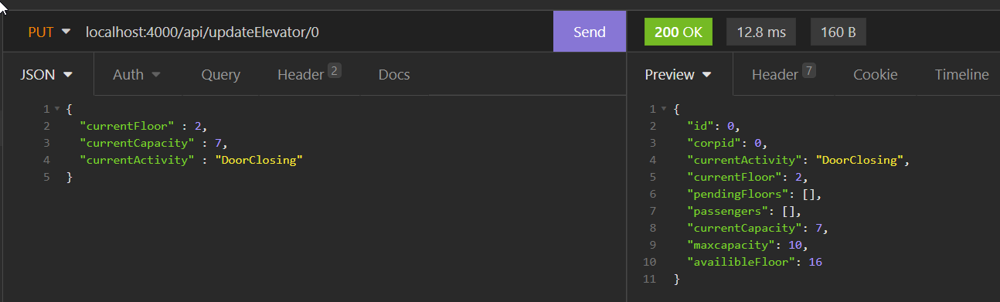

# Virbela Coding Test

## How to run this codes test.

1. Clone this respository into an empty workspace.
2. run "npm install" to install all dependencies
3. run "npm start" a script will run nodemon

### 
Once started the index.js script will spawn 1 corperation with a random max floor level, random amount of elevators and random amount of elevator users. When your local server is launched you can come back to this readme test out the endpoints without having to type it in.

## **PUT**
|API Endpoints|Description|
|-----------|-------------|
|http://localhost:4000/api/updateElevator/#| Update elevator data in a single endpoint.|
|http://localhost:4000/api/updateEleFloor/#| Update elevator current floor.|
|http://localhost:4000/api/updateEleCurCap/#| Update elevator current capacity.|
|http://localhost:4000/api/updateEleAct/#| Update elevator current activity.|

## **GET**
|API Endpoints|Description|
|-----------|-------------|
|<b>corporation</b>|
|http://localhost:4000/api/corps/|Return all corperation and it's data.|
|http://localhost:4000/api/corps/?id=#|Return a corperation with specific id.|
|http://localhost:4000/api/corps/?MaxFloor=#|Return all corperation with specific max floor level.|
|<b>Elevators</b>|
|http://localhost:4000/api/elevators/|Return all elevators.|
|http://localhost:4000/api/elevators/?id=#|Return elevators with unique id.|
|http://localhost:4000/api/elevators/?corpid=#|Return elevators that belong to a specific corperation.|
|http://localhost:4000/api/elevators/?currentFloor=#|Return all elevators that are currently on a specific floors.|
|http://localhost:4000/api/elevators/?currentCapacity=#|Return all elevators with specific capacity.|
|http://localhost:4000/api/elevators/?availibleFloor=#|Return all elevators with specific max floors.|
|<b>Elevator users</b>| |
|http://localhost:4000/api/users/|Return all users.|
|http://localhost:4000/api/users/?id=#|Return a user with a unique id.|
|http://localhost:4000/api/users/?corpid=#|Return all user that belong to a corperation id.|
|http://localhost:4000/api/users/?currentActivity=|Retrun all user filter by activity. valid strings: Idle, Moving, InsideElevator, ExitElevator, Working, AtLunch, DoneWithWork|
|http://localhost:4000/api/users/?userName=|Return a user by a username. NOTE: it's randomly generated name. You can find by calling the /users/ endpoint.|
|http://localhost:4000/api/users/?workfloor=#|Return all user working on a specific floor.|
|http://localhost:4000/api/users/?lunchfloor=#|Return all user with their favorite lunch floor.|
|http://localhost:4000/api/users/?startHour=#|Return all user with common starting work hours.|
|http://localhost:4000/api/users/?lunchHour=#|Return all user with common starting lunch hours.|
|http://localhost:4000/api/users/?endHour=#|Return all user with common ending work hours.|
